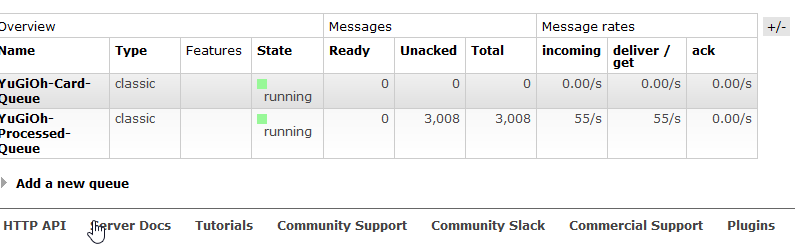
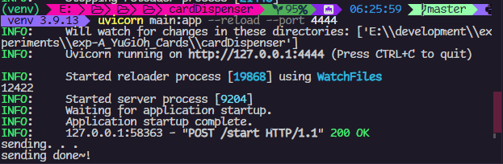

### the way this goes is

- CardDispenser -> sends card info to `YuGiOh-Card-Queue` rabbitMQ bus thru the default exchange,
- CardProcessor <- Read the card data from `YuGiOh-Card-Queue`
- CardProcessor -- process the card
- CardProcessor -> Sends the processed cards to `YuGiOh-Processed-Queue`
- Card_Saver    <- Reads from `YuGiOh-Processed-Queue`
- Card_Saver    -- saves the cards into `postgres db`  

you have yugioh cards in a file which u got from: [YgoProDeck](https://db.ygoprodeck.com/) ; get the cards like this and don't annoy their api

```bash
http GET https://db.ygoprodeck.com/api/v7/cardinfo.php > AllCards.json
```

> if u don't have `httpie` install it via `python`,`scoop` or `package manager`

---
<p> i was sick and bored so my tired brain came up with this, it serves no practical purpose, think of it as an experiment  </p>

>
> card info gotten from [Ygoprodeck.com](https://db.ygoprodeck.com/api/v7/cardinfo.php), i got all the cards as to not annoy their API






---

# Run

1. get RabbitMQ started:

```powershell
docker run --hostname YuGiOh-rabbit  --name yugioh-bus -p 5672:5672 -p 15672:15672 rabbitmq:3-management
```

> 5672: to access the node
> 15672: to access the web interface

2. start pubing the cards

```powershell
cd cardDispenser
python -m venv venv
.\venv\Scripts\activate # source venv/bin/activate
pip install -r reqs.txt

uvicorn main:app --reload -p 4444 # or whatever u want
```

3. run the c# code

4. save the cards from the queueueueue to the database
    a.
        i. start a postgress instance `docker container run -p 5432:5432 --name testgres postgres`
        i. make sure it's correctly sat up either by dbeaver or thru the terminal
        i. `docker exec -it <container name (docker ps helps)> psql -U admin`
    b.
        cd into `card_saver` -> `cargo build` -> `cargo run`

# Starring

1. FastAPI as pythonAPI that will keep pumping RAW card info as JSON into rabbitMQ `queueName=YuGiOh-Card-Queue`, it has 2 endpoints:
    1. Start. /start. ; will start populating the que
    2. Stop. /stop; will cease hostilites and declare peace. . . .

> the way the inital plan was for the API to get either a `start` or `stop` commands via REST and ivoke an event depending, at least that was the main idea, toggle switching, but as the data we have is finite, i didnt want duplication hence the way i did it.

2. RabbitMQ as the bus that will distribute the info between the apps

3. C# 7 as the cards proccessor, it takes the card from pyPi and removes some props and throws it again at the space rabbit this time onto a different queue `queueName=YuGiOh-Processed-Queue`

4. rust as the database guy

> the `loop` is pointless as this should just run once and only once, if this was supposed to listen infinitly it should invoke events or something anyways i'm having fun
> used raw sql cause it's healthier than an ORM (you don't know what they put in there)

# Resources

1. [turn Json to language](https://json2csharp.com/)
1. [RabbitMq c# docs](https://www.rabbitmq.com/tutorials/tutorial-one-dotnet.html)
1. [RabbitMq python docs](https://www.rabbitmq.com/tutorials/tutorial-three-python.html)
1. [python events package](https://pypi.org/project/Events/)
1. [this](https://stackoverflow.com/questions/47290108/how-to-open-rabbitmq-in-browser-using-docker-container) to read queue size
1. [microsoft json docs](https://learn.microsoft.com/en-us/dotnet/standard/serialization/system-text-json/how-to?pivots=dotnet-8-0)
1. [rust by example](https://doc.rust-lang.org/rust-by-example/)
1. [postgres docs](https://www.postgresql.org/docs/8.3/tutorial-transactions.html)
